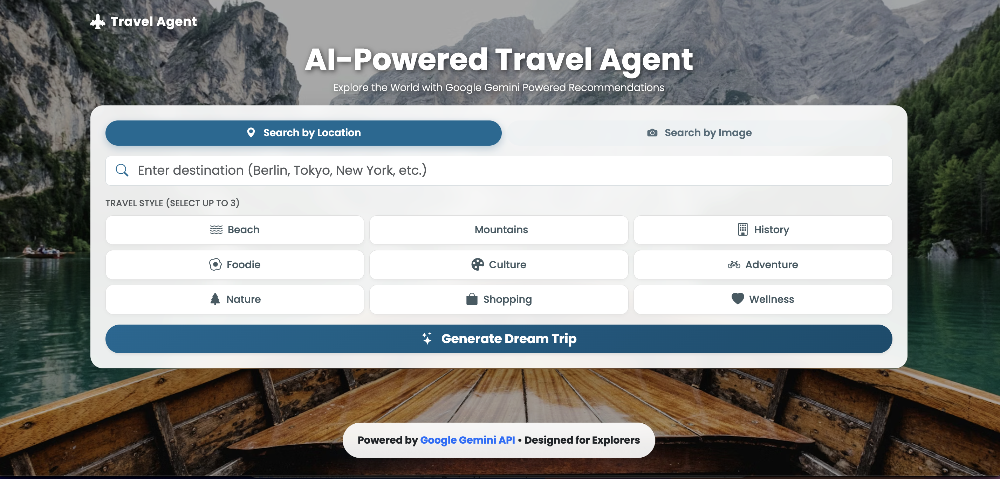
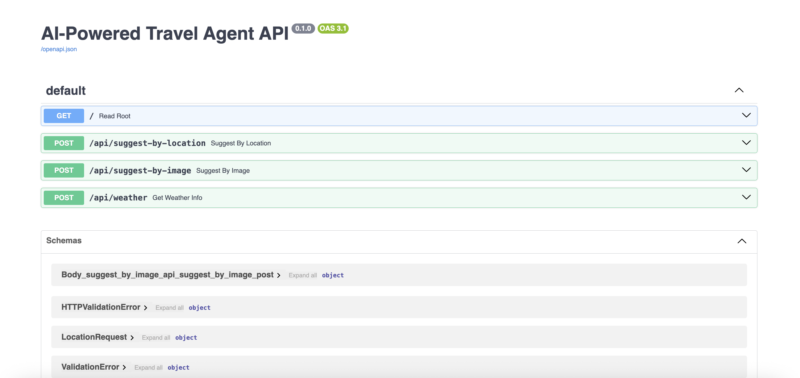

# 🌍 AI-Powered Travel Agent

An intelligent, full-stack travel agent application that leverages Google's Gemini API to deliver personalized travel recommendations. This project demonstrates advanced AI engineering capabilities, including structured data generation, multimodal processing, and dynamic tool integration.



## 🚀 Project Overview

This application serves as a comprehensive portfolio piece showcasing the integration of Large Language Models (LLMs) into a modern web architecture. It goes beyond simple text generation by implementing a sophisticated AI agent capable of understanding user intent through both text and image inputs, and interacting with external systems via function calling.

### Key Features

-   **Intelligent Location-Based Planning**: Utilizes Gemini's natural language processing to generate structured, context-aware travel itineraries based on user queries.
-   **Multimodal Discovery**: Implements computer vision capabilities allowing users to upload images of landmarks or sceneries to find semantically similar destinations.
-   **Dynamic Tool Use (Function Calling)**: Demonstrates the agent's ability to determine when to call external functions—specifically for fetching real-time weather data—to enrich travel suggestions.
-   **Personalized Experience**: Uses system instructions to tailor recommendations based on specific user preferences (e.g., "Adventure," "Relaxation," "Historical").
-   **Safety & Ethics**: Integrates robust safety filters to ensure all generated content adheres to ethical guidelines and moderation standards.
-   **Responsive UI**: A clean, modern interface built with Bootstrap that provides a seamless user experience across devices.

## 🔮 Upcoming Features

-   **Voice-Activated Search**: Integration of speech-to-text capabilities for hands-free travel planning.
-   **Interactive Maps**: Visualizing itineraries on dynamic maps with route optimization.
-   **User Accounts & History**: Saving favorite destinations and past itineraries for future reference.

## 🧠 AI Engineering Skills Demonstrated

This project highlights a range of advanced skills in AI and full-stack development:

*   **Prompt Engineering & Optimization**: Designing complex prompts to ensure consistent, structured JSON outputs suitable for application integration.
*   **Multimodal AI Processing**: Handling and reasoning across different modalities (text and images) to create a richer user interaction.
*   **Tool Use & Function Calling**: Implementing the logic for the AI to autonomously invoke defined functions to retrieve real-time data, bridging the gap between static knowledge and dynamic information.
*   **System Instructions**: Configuring the model's behavior and persona to align with specific application needs and user preferences.
*   **AI Safety & Moderation**: Implementing safeguards to filter harmful or inappropriate content, ensuring a safe user environment.
*   **Full-Stack Integration**: Seamlessly connecting a Python/FastAPI backend with a responsive frontend, managing API state, and handling asynchronous AI responses.

## 🏗️ Tech Stack

### Backend
-   **Python 3.9+**: Core programming language.
-   **FastAPI**: High-performance web framework for building APIs.
-   **Google Gemini API**: The core intelligence engine (using models like `gemini-pro` and `gemini-pro-vision`).
-   **Pydantic**: For robust data validation and settings management.
-   **Pillow (PIL)**: For image processing and handling.

### Frontend
-   **HTML5 & CSS3**: Semantic structure and custom styling.
-   **JavaScript (ES6+)**: Client-side logic and asynchronous API integration.
-   **Bootstrap 5**: Responsive design framework.

## 📂 Project Structure

```
google_gemini/
├── api/
│   ├── main.py                 # FastAPI backend application & AI logic
│   ├── requirements.txt        # Python dependencies
│   └── .env                    # Environment variables (API keys)
├── gui/
│   ├── index.html             # Main user interface
│   ├── styles.css             # Custom styling
│   └── app.js                 # Frontend logic & API communication
└── README.md                  # Project documentation
```

## ⚡ Setup & Installation

### Prerequisites
-   Python 3.9 or higher
-   A Google Gemini API key ([Get one here](https://aistudio.google.com/))
-   Node.js (optional, for advanced frontend tooling)

### 1. Backend Configuration

Navigate to the backend directory:
```bash
cd api
```

Create and activate a virtual environment:
```bash
python3 -m venv .venv
source .venv/bin/activate  # On Windows: .venv\Scripts\activate
```

Install dependencies:
```bash
pip install -r requirements.txt
```

Configure environment variables:
Create a `.env` file in the `api` directory and add your API key:
```env
GOOGLE_GEMINI_API_KEY=your_actual_api_key_here
```

Start the server:
```bash
python main.py
```
*The backend will launch at `http://localhost:8000`*

### 2. Frontend Launch

Navigate to the frontend directory:
```bash
cd gui
```

Open `index.html` directly in your browser, or serve it locally:
```bash
python3 -m http.server 3000
```
*Access the app at `http://localhost:3000`*

## 📖 Usage Guide

1.  **Explore by Location**: Enter a city (e.g., "Kyoto") and select your interests (e.g., "History," "Food"). The AI will generate a tailored itinerary.
2.  **Visual Search**: Upload a photo of a beach or mountain. The AI analyzes the visual features and suggests similar destinations worldwide.
3.  **Real-time Insights**: When viewing a destination, the app automatically triggers a function call to fetch and display the current weather conditions.



## 🤝 Contributing

This project is open for contributions! Whether you're looking to add new AI features, improve the UI, or optimize the backend, feel free to fork the repo and submit a pull request.

---
**Built with 💙 using Google Gemini & Python**
